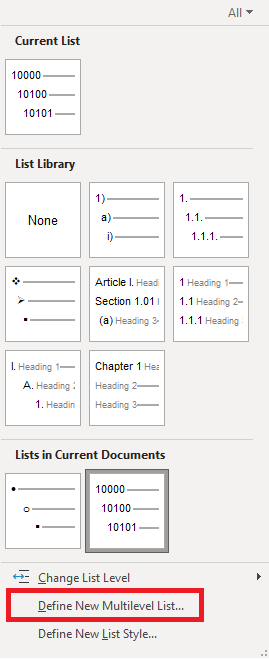

The PDF file here is an outline-numbered list of the items in Wikipedia's [Outline of Academic Disciplines](https://en.wikipedia.org/wiki/Outline_of_academic_disciplines), as of Nov. 3, 2023. I was inspired to create it after watching [Scott Scheper's videos](https://www.youtube.com/@scottscheper) on using these subjects to organize the main box(es) of his antinet zettelkasten.

I have deviated from Scheper's guidance about numbering in order to accommodate all of the items in the list, avoiding duplication of any entries. Practically speaking, the differences are:
* The top-level items are 5-digits instead of 4 (Humanities = 10000, not 1000).
* The numbers for levels 2-5 are in 01, 02, 03... to accommodate situations where anywhere in the tree you might find more than nine items at that level. Doing this makes it possible to remove delimiters between levels.
* After the top 5-digit level, there is a period separator. I find this makes the longer sequences easier to read.

Some illustrations:

The 01 numbering at level 2 accommodates the 23 items at that level under Applied Science, without introducing a conflict between a level 2 item and level 3 item in the same discipline:
* 50203 Applied Science | Architecture and design | Historic preservation
* 52300 Applied Science | Transportation

The numbering of an item at level 4 is a bit easier to read when preceded with a period,and the 01-style numbering avoids conflicts between levels 2 and 3, and 3 and 4.
* 51101.01 Applied Science | Mechanical Engineering | Aerospace engineering | Aeronautics
* 51111 Applied Science | Mechanical Engineering | Mass transfer

If you don't like my solution, but still want to have a pre-numbered list of the academic disciplines, feel free to download the Word document and change the scheme. Everything you need to do that is under the Multi-level list item in the Paragraph section of the ribbon.

